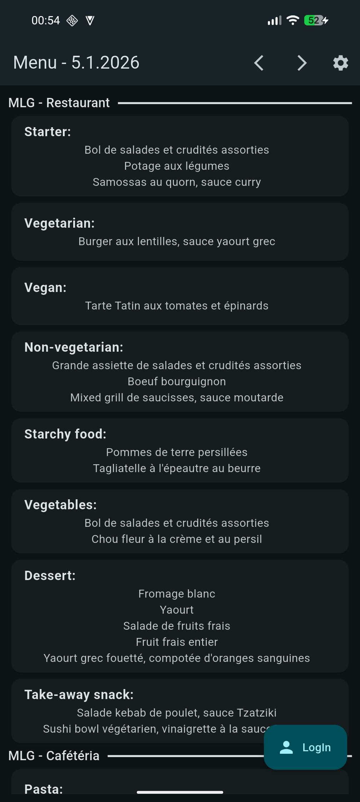
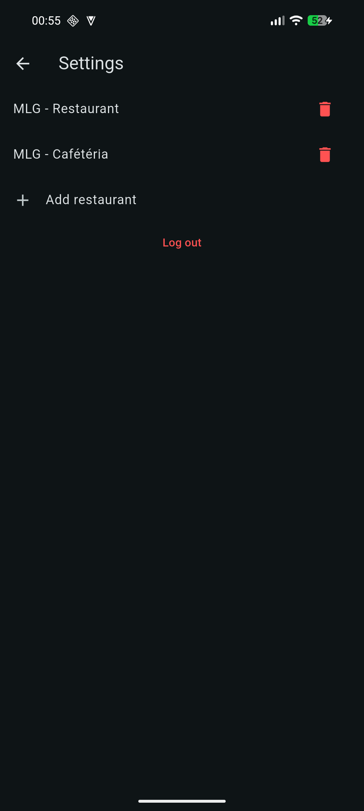
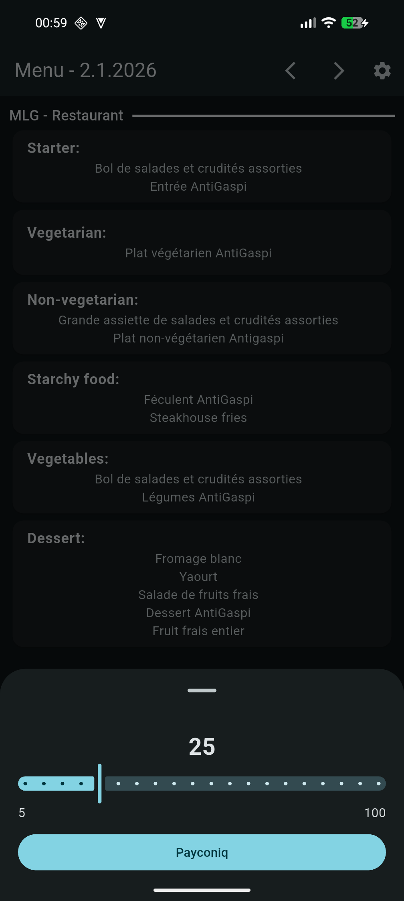

# BetterMenu

### Legal & Usage Notice
This project is an independent, unofficial application.
It is not affiliated with, endorsed by, or maintained by Restopolis or the Luxembourg Ministry of
Education.

This repository does not include any proprietary API credentials and is intended for educational
purposes only.

If you are a rights holder and believe this project causes an issue, please open an issue or contact
me.

Data is obtained from a non-public interface used by the official app. This repository does not
include implementation details.

Contact: henrik@zaenger.lu

